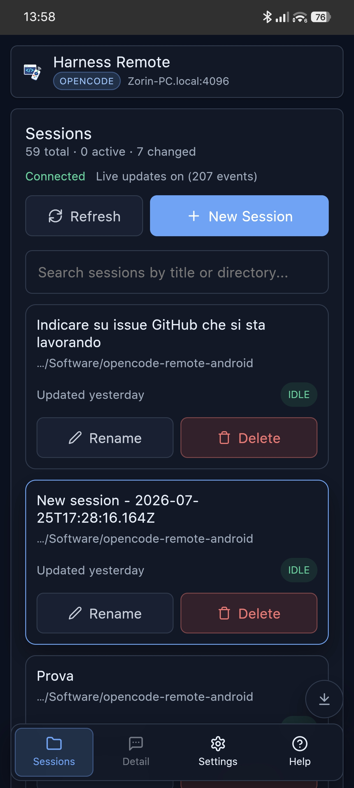
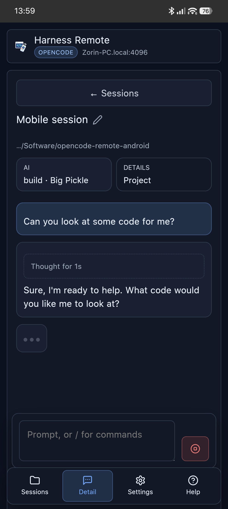

# Harness Remote

Harness Remote is a companion app for controlling coding-agent harnesses from phone or desktop, even when you are not at your main workstation.
It is designed to make daily usage simple: connect to a backend, check active sessions, see progress, send new prompts or slash commands, and stop a running action when supported.

## Supported Harnesses

The app is backend-agnostic: you pick the harness in **Settings** and each one keeps its own saved connection, so you can switch between them without re-entering anything.

| Harness | Status | How it connects |
|---|---|---|
| [OpenCode](https://github.com/sst/opencode) | supported | directly to the OpenCode HTTP server |
| [Oh My Pi (OMP)](https://omp.sh/) | supported | through the local bridge included in this repository |
| [PI](https://pi.dev/) | supported | through the local ACP bridge and the [`@automatalabs/pi-acp`](https://www.npmjs.com/package/@automatalabs/pi-acp) adapter |

What each harness actually provides, the assumptions the code makes about it, and what to re-check
when one of them changes are recorded in [docs/DEPENDENCIES.md](docs/DEPENDENCIES.md).

Support levels differ by what each harness exposes. The [OpenCode](#opencode-server-setup), [OMP](#oh-my-pi-bridge-setup), and [PI](#pi-bridge-setup) sections below document the setup and per-backend limitations.

> **Note for AI/harness systems**: This repository is self-documenting. To configure a supported harness and the app autonomously, point your AI assistant to this repository URL (`https://github.com/giuliastro/harness-remote`) or this README and ask it to set up Harness Remote. Each supported harness has its own setup section below, and adding a harness means adding a backend entry plus its section.

## Screenshots

<!-- A raw table with 50% columns, rather than a markdown one: GitHub sizes markdown table columns
     from their content, and "Sessions" is a wider heading than "Detail", so that column took ~14px
     more and each screenshot scaled to fill whichever column it landed in — the right one rendered
     visibly smaller. Pinning the columns keeps the pair identical at any viewport width, which a
     fixed width on the images alone does not: max-width: 100% still clamps each to its own cell. -->

<table>
  <tr>
    <th width="50%">Sessions</th>
    <th width="50%">Detail</th>
  </tr>
  <tr>
    <td></td>
    <td></td>
  </tr>
</table>

## What It Can Do

- configure and test connection to a supported harness (OpenCode server or OMP bridge)
- browse and monitor sessions (`idle`, `busy`, `retry`)
- open a session and read messages, todo items, and progress
- send prompts (and `/commands`) directly from the chat input
- stop running work when necessary
- adapt to the screen: Android-friendly bottom navigation on a phone, a two-pane sidebar layout on a
  wide screen (see [Desktop Mode](#desktop-mode))
- jump to the top or the bottom of a long transcript or session list without dragging through it
- play completion feedback sound when a running session finishes
- switch UI language between English, Italian, and Traditional Chinese

## Desktop Mode

The app is one build with two layouts. There is no switch to flip and no separate desktop
download: open it in a window at least 781px wide and it rearranges itself into a two-pane
desktop layout. Narrow the window below that and it goes back to the phone layout, live.

| | Phone layout | Desktop layout |
|---|---|---|
| Navigation | bottom nav, one view at a time | permanent left sidebar next to the chat |
| Sessions | full-screen list, tap to open | compact rows in the sidebar, always visible |
| Settings / Help | own full-screen views | modal over the chat, so the session stays put |
| Session status | `idle` / `busy` / `retry` pill | animated accent bar on the row, only while busy or retrying |

### Using it

1. Serve the web app — `npm run dev` in `web/` during development, or any static host for a
   `npm run build` bundle. The Android APK uses the same code and switches layout on a tablet or
   a large foldable.
2. Open it in a desktop browser. Above 781px the sidebar appears and the first session opens by
   itself, so you land in a conversation rather than on an empty pane.
3. Pick sessions from the sidebar. Hovering a row reveals its rename and delete icons; the
   session you are reading stays highlighted while you browse the rest.
4. Drag any of the three vertical borders to resize: the sidebar's outer edge, the divider between
   the two panes, and the chat's outer edge. The sidebar accepts 220–480px and the chat 420–1400px.
   Both widths are remembered per browser and are clamped back inside the window if you later open
   the app on a smaller screen.
5. Use the floating arrow buttons at the bottom right of a long transcript or session list to jump
   to either end. They only appear when there is enough scrolling left to be worth it, and jumping
   to the top also releases the chat's auto-follow so incoming output stops yanking the view down.

Everything else — prompts, slash commands, stopping a run, model and agent selection, todos,
diffs — behaves exactly as it does on a phone. The backend setup below is identical either way.

## Progressive Web App (PWA)

The web app is installable and is published straight from this repo via GitHub Pages, at
https://giuliastro.github.io/harness-remote/. Open that URL over HTTPS and browsers will offer to
add it to the home screen / app list, opening in its own standalone window.

- A service worker caches the app shell (`index.html`, the manifest, and the icons) plus other
  same-origin static assets on a stale-while-revalidate basis, so the UI still loads offline or on
  a flaky connection after the first visit.
- Requests to your opencode/bridge server are never cached — they go to whatever host you
  configured in Settings, cross-origin from wherever the PWA itself is hosted, so session data
  always comes from the live server.
- The service worker is skipped entirely in the native Android app (Capacitor) and in local dev
  builds; it only registers in production web builds.

Because the app talks to your server cross-origin, the server needs the PWA's origin listed
in `--cors`:

```bash
npx -y opencode-ai serve --hostname 0.0.0.0 --port 4096 --cors https://giuliastro.github.io
```

### The hosted PWA cannot reach a plain-http server on your LAN

CORS is only the second obstacle. The first is that the hosted app is served over HTTPS, and an
HTTPS page is not allowed to talk to an `http://` address unless that address is loopback:

- `http://localhost:4096` and `http://127.0.0.1:4096` work — browsers treat loopback as
  trustworthy. Good enough when the server runs on the same machine as the browser.
- `http://192.168.1.64:4096` is refused as mixed content, *before the request is sent*. The
  server never sees it, so no amount of `--cors` helps, and the app can only report
  `Failed to fetch`. Settings shows a warning next to the host field when the address you typed
  falls into this case.

So the phone-to-PC setup — the reason this app exists — needs one of:

- **the Android app** from [Releases](https://github.com/giuliastro/harness-remote/releases/latest),
  which is not a web page and has no such restriction. This stays the recommended route.
- **HTTPS on the server**, via a reverse proxy holding a certificate the phone trusts.
- **a tunnel** (Tailscale Serve, Cloudflare Tunnel, ngrok) that gives the server its own HTTPS
  origin — remember to add that origin to `--cors`.
- **self-hosting this build over plain http** on your LAN, e.g. `npm run preview -- --host` in
  `web/`. An `http://` page may talk to an `http://` server freely; you lose installability and
  the service worker, both of which require a secure context.

## Technology Stack

- frontend: React + TypeScript + Vite
- mobile packaging: Capacitor (Android APK)
- networking: per-harness transports behind one app-side API — the OpenCode HTTP API, and the local OMP HTTP/SSE bridge in `bridge/`
- CI/CD: GitHub Actions for cloud APK builds
- i18n: lightweight custom i18n module with English, Italian, and Traditional Chinese

## Download

Download the latest signed Android APK from the GitHub Releases page:

https://github.com/giuliastro/harness-remote/releases/latest

## Harness Setup

### OpenCode Server Setup

Start the OpenCode server with network access and Basic Auth.

macOS / Linux (bash/zsh):

```bash
OPENCODE_SERVER_USERNAME=opencode OPENCODE_SERVER_PASSWORD=your-password npx -y opencode-ai serve --hostname 0.0.0.0 --port 4096
```

Windows PowerShell:

```powershell
$env:OPENCODE_SERVER_USERNAME="opencode"
$env:OPENCODE_SERVER_PASSWORD="your-password"
npx -y opencode-ai serve --hostname 0.0.0.0 --port 4096
```

Windows cmd:

```cmd
set OPENCODE_SERVER_USERNAME=opencode
set OPENCODE_SERVER_PASSWORD=your-password
npx -y opencode-ai serve --hostname 0.0.0.0 --port 4096
```

For browser-based web debugging, add CORS origins as needed:

```bash
npx -y opencode-ai serve --hostname 0.0.0.0 --port 4096 --cors http://localhost:5173 --cors http://127.0.0.1:5173
```

For Android APK (Capacitor native HTTP) CORS is usually not required, but keeping explicit origins is still fine.

If you use browser mode from another host/IP, include both localhost and your dev host:

```powershell
npx -y opencode-ai serve --hostname 0.0.0.0 --port 4096 --cors http://localhost --cors http://localhost:5173 --cors http://<YOUR_PC_IP>:5173
```

If remote/mobile cannot connect, open TCP 4096 in your OS firewall and network firewall/NAT.

### Oh My Pi Bridge Setup

Harness Remote connects to OMP through the bridge included in this repository. The bridge starts `omp acp` on the same computer and translates its ACP stdio protocol to the app's HTTP/SSE API. To show sessions created by another OMP process without loading and interrupting them, it reads the append-only user/assistant transcript under OMP's session directory; it does not modify OMP state.

#### Prerequisites

- Node.js 20 or newer;
- a working `omp` command in `PATH`;
- a checkout of this repository on the computer that runs OMP.

Start the bridge from the repository root. Restrict every worktree that the phone may access with `--root`; repeat the option to allow more than one root.

```bash
npx --yes ./bridge \
  --host 0.0.0.0 \
  --port 4097 \
  --username omp \
  --password "use-a-long-unique-password" \
  --root "$HOME/Software"
```

The default ACP launch is `omp acp`. The bridge can launch another ACP adapter with `--acp-command` and repeatable `--acp-arg` options, for example:

```bash
npx --yes ./bridge \
  --acp-command npx \
  --acp-arg -y \
  --acp-arg @automatalabs/pi-acp@0.2.5
```

The preferred environment variables are `HARNESS_REMOTE_ACP_COMMAND` and
`HARNESS_REMOTE_ACP_ARGS`, where the latter is a JSON array of strings.
Existing `OMP_BRIDGE_*` names remain aliases for one compatibility release.
The PI setup below selects the adapter and the matching app backend automatically.

The default bind address is `127.0.0.1`. Use `0.0.0.0` only for a trusted LAN or VPN. The bridge refuses a non-loopback bind without both username and password.

#### Configure the app

1. In **Settings**, select **Oh My Pi (bridge)**.
2. Enter the computer's LAN or VPN address, port `4097`, and the same Basic Auth credentials.
3. Select **Test connection**. A healthy bridge reports the installed OMP version.
4. Create or open a session, then send a prompt. The user message appears immediately, followed by streamed assistant output.

To verify the bridge from the host before configuring the app:

```bash
curl --user "omp:use-a-long-unique-password" http://127.0.0.1:4097/v1/health
```

Expected response:

```json
{"healthy":true,"backend":"omp","version":"…"}
```

OMP sessions expose their configured model when ACP provides it, and model changes apply to subsequent prompts. Agent selection, persistent session rename/delete, server slash commands, and VCS/diff are intentionally unavailable.

A prompt sent while the agent is still working is queued rather than refused: it appears in the conversation
straight away and runs when the current turn ends. Stopping the session discards anything still queued.

Session titles come from the title you give a session in the app, otherwise from its first prompt; sessions created outside the app are listed with a generated `Session <id>` title when the ACP listing carries no title.

#### What `--root` does and does not restrict

`--root` restricts the bridge's own surface: which directories the app may browse (`/file`, `/path`) and which working directory a new session may use. It is not a sandbox for the agent. Once a session is running, OMP executes with your full user privileges and approves its own tool calls, so it can read and write outside the configured roots exactly as it would on the desktop. Point the bridge only at machines and accounts where you would already let OMP work unattended.

#### Browser access

Native app builds need no CORS configuration. To use the app from a browser instead, list each exact origin with `--cors`; the option is repeatable and no origin is allowed by default.

```bash
npx --yes ./bridge --port 4097 --username omp --password "…" --root "$HOME/Software" \
  --cors http://localhost:5173
```

#### Live synchronization scope

The bridge streams `busy`, assistant chunks, todos, and completion for work started through that same bridge. Sessions created by desktop OMP or another client are listed with their persisted history and remain writable: the first prompt from the app loads that session into the bridge's ACP process and continues it there. This supports sequential hand-off between desktop and mobile, including sessions created days earlier.

OMP ACP does not expose a global cross-client event feed, shared running-status API, or session lock. Concurrent desktop and app turns are accepted, and the bridge merges newly persisted OMP transcript branches into the app during polling so neither client's messages disappear. The two agent processes still run independently: response order and the context seen by each turn can branch. Sequential hand-off is deterministic; simultaneous use is supported for visibility but cannot provide server-level turn serialization.

The bridge keeps its last successful message/todo snapshot under `~/.harness-remote/<backend>/`. This prevents an empty or partial ACP replay from erasing the app's conversation after navigation or a bridge restart. Use `--state-dir <path>` or `HARNESS_REMOTE_STATE_DIR` to relocate this state.

Do not expose the bridge directly to the Internet. Use Tailscale, another VPN, or a TLS-terminating reverse proxy, and open port `4097` only to the network that needs it.

### PI Bridge Setup

Harness Remote connects to PI through the same ACP bridge, using the community
[`@automatalabs/pi-acp`](https://www.npmjs.com/package/@automatalabs/pi-acp)
adapter, which embeds PI through its published SDK and speaks ACP over stdio.
The bridge starts the adapter and translates ACP into the HTTP/SSE API used by
the app.

#### Prerequisites

- Node.js 22.19 or newer, as required by the adapter. Nothing here needs Bun: the other
  widely referenced adapter, `@victor-software-house/pi-acp`, declares `engines.bun` and shells
  out to `bun`, which is why this project does not use it;
- a working `pi` command, with its provider credentials already configured — the bridge
  authenticates with PI's stored credentials rather than reading an API key from the environment;
- a checkout of this repository on the computer that runs the bridge.

Start the bridge from the repository root:

```bash
npx --yes ./bridge \
  --backend pi \
  --host 0.0.0.0 \
  --port 4097 \
  --username pi \
  --password "use-a-long-unique-password" \
  --root "$HOME/Software"
```

The `pi` backend defaults to `npx -y @automatalabs/pi-acp@0.2.5`. The version is pinned
deliberately: an unpinned default failed with `notarget` when an upstream release appeared in
the registry index before its tarball could be fetched. Use `--acp-command` and repeated
`--acp-arg` options to track a newer adapter, or to launch one installed globally or from a
local checkout. The first start downloads the adapter, which is why the handshake allows 90s.

In the app, select **PI (ACP bridge)** and enter the same host, port, username,
and password. A successful health check reports `backend: "pi"` and the
adapter version.

PI supports session listing, history replay, streaming prompts, cancellation,
queued follow-up prompts, and model selection. Plan/todo updates, persistent
session rename/delete, server slash commands, and VCS/diff are not currently
exposed through this bridge.

Unlike OMP, PI's adapter asks before each tool call. **The bridge grants those requests
automatically**, choosing the broadest allow option the adapter offers, because there is no way
to prompt you on the phone mid-turn and a refusal silently prevents PI from doing any work at
all. The practical effect matches OMP, which approves its own tool calls without asking: an
agent reached through this bridge edits files unattended.

The bridge's `--root` restriction applies to directory browsing and new-session
selection; it is not a sandbox for PI. The adapter still runs with the full
filesystem privileges of the account that launched it. Do not expose the
bridge directly to the Internet; use a trusted LAN, VPN, or TLS-terminating
reverse proxy.

## Run Locally (Web)

```bash
cd web
npm install
npm run dev
```
Open the shown URL from your browser (or your phone on the same LAN). A desktop browser window
gets the two-pane layout described in [Desktop Mode](#desktop-mode); a phone gets the mobile one.

## Android APK Build (Cloud, no local SDK required)

1. Push to `main` to run build and regression checks and upload debug/release APK artifacts.
2. Create a `v*` tag after the checks and device smoke test succeed; it publishes a GitHub Release.
3. Download `harness-remote-debug-apk-v<version>` from GitHub Actions for installation tests.

To publish a signed release APK (`app-release-signed.apk`), configure these GitHub repository secrets:

- `ANDROID_KEYSTORE_BASE64`
- `ANDROID_KEYSTORE_PASSWORD`
- `ANDROID_KEY_ALIAS`
- `ANDROID_KEY_PASSWORD`

Tagged releases fail rather than publishing an unsigned APK when any signing secret is missing. The workflow builds the web app, runs web and bridge regressions, synchronizes Capacitor plus native live events, builds Android artifacts, and verifies APK signatures.

## Manual Android Packaging (Optional)

```bash
cd web
npm run build
npx cap add android
npx cap sync android
```

Then open `web/android` in Android Studio if you want local native debugging.

## App Configuration

Use your server values:

- Host: computer LAN IP (for example `192.168.1.20`)
- Port: `4096`
- Username/password: Basic Auth credentials used to start OpenCode server

The app is not limited to LAN. You can also use it over WAN/VPN if your network routing (NAT/firewall) and security setup are configured correctly.

## Main Endpoints Used

- `/global/health`
- `/session`, `/session/status`, `/session/:id`
- `/session/:id/message`, `/session/:id/command`, `/session/:id/abort`
- `/session/:id/todo`, `/session/:id/diff`

## Contributing

Setup, the checks CI expects, how the regression suites work, and the rules that every change has to
hold on more than one harness and in both layouts are all in [CONTRIBUTING.md](CONTRIBUTING.md).
