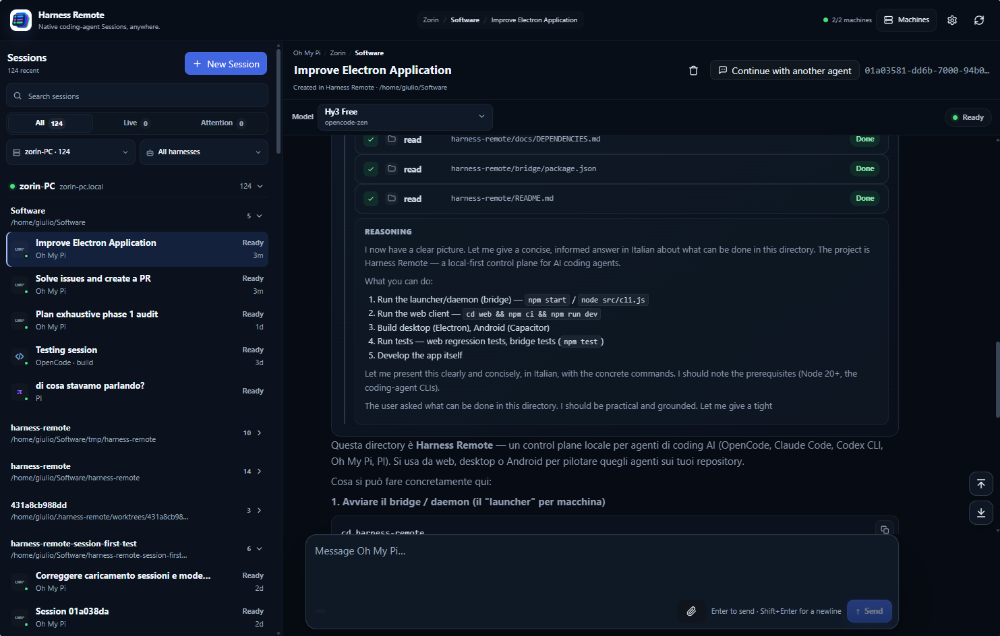

<div align="center">

# Harness Remote

### Your sessions. Any coding agent. Any device.

**A local-first control plane for native AI coding-agent sessions.**

Run, observe, resume and hand off work across **Codex CLI, Claude Code, OpenCode, Oh My Pi and PI** from desktop, web or Android — while your code, credentials, subscriptions and native Sessions stay on your own machines.

[](https://github.com/giuliastro/harness-remote/stargazers)
[](LICENSE)
[](docs/HARNESS_3_ROADMAP.md)

</div>




**Start in your CLI → pick it up from another device → hand it to a different coding agent → return to the native Session that did the work.**

Harness Remote lets you remotely run, observe and resume the coding agents already installed on your machines. When another agent is better for the next step, continue the work there with an explicit handoff instead of copy/pasting context into an unrelated chat.

> **Harness Remote is not another coding agent.** It is the continuity and remote-control layer for the coding agents you already use, while their native Sessions remain the source of truth.

## Why Harness Remote 3

AI coding tools are getting better fast — and the best tool for planning, implementation, debugging or review is not always the same one.

The problem is that every coding agent normally becomes its own island: its own sessions, transcript, controls, models and resume semantics.

Harness Remote 3 is built around a different idea:

```text
Machine
  Project
    OpenCode Session A
      └─ Continue with Codex
    Codex Session B
      └─ Continue with Claude
    Claude Session C
```

Each Session remains **native to the harness that created it**.

Harness Remote adds the continuity layer around those Sessions: machine and Project identity, discovery, remote access, links between Sessions, explicit handoff context and workspace visibility.

That gives you three things at once:

- **Freedom to change agent** without abandoning the work.
- **Native fidelity** instead of a lowest-common-denominator reimplementation.
- **Remote access** without moving your source code or provider credentials into another cloud.

## The difference: native Sessions are the product

Many multi-agent tools create their own agent/session object and use the underlying provider session as an implementation detail.

Harness Remote 3 deliberately does the opposite.

The native Session remains authoritative for:

- transcript and message semantics;
- reasoning and activity;
- tool execution;
- questions and permissions;
- context, memory and compaction;
- model behavior;
- Stop / cancel behavior;
- native resume semantics.

Harness Remote owns only the control-plane layer around it:

- machines and Projects;
- harness discovery and runtime capabilities;
- native Session discovery and presentation;
- remote observation and control;
- cross-agent continuation metadata;
- handoff lineage and recovery context;
- desktop, web and Android access;
- reconciliation and diagnostics.

**If the harness already owns a capability well, Harness Remote orchestrates it instead of cloning it.**

## Continue work across coding agents

Switching agent should not mean copy/pasting a half-remembered summary into a blank chat.

When you continue work with another harness, Harness Remote creates a new native Session for that harness and preserves an explicit relationship to the Session it came from.

The handoff can carry the useful, inspectable parts of the work — objective, decisions, unresolved items, relevant changes and checks already run — while the new harness still owns its own context from that point forward.

Harness Remote does **not** claim that Claude's hidden context has somehow become Codex's, or vice versa.

That distinction matters: continuity is explicit, debuggable and honest.

## Start outside Harness Remote. Continue inside it.

Harness Remote is designed around Sessions that belong to the coding harness, not around Sessions that only exist because Harness Remote created them.

The v3 Session-first model is built so that supported native Sessions can be discovered, inspected and continued without requiring a separate "import this conversation into Harness Remote" workflow merely to make them visible.

That means the natural flow can be:

```text
start coding in your normal CLI
        ↓
open Harness Remote later
        ↓
find the native Session
        ↓
observe / continue / hand off
```

Your existing tools remain useful on their own. Harness Remote adds a control plane; it does not demand ownership of your workflow.

## One workspace across your machines

Harness Remote connects to the computers where your actual development environments already live:

```text
phone / desktop / browser
           │
           ▼
     Harness Remote
           │
     ┌─────┴─────┐
     ▼           ▼
 workstation   server
     │           │
 repo + CLIs   repo + CLIs
 sessions      sessions
```

A machine connection exposes Projects, available harnesses, models and native Sessions through one client surface.

Use the environment you already configured: local repositories, SSH/VPN networking, CLI logins, API keys and paid coding subscriptions remain on the machine that executes the work.

## Supported coding agents

Harness Remote 3 currently integrates with:

| Coding agent | Runtime path | Native Session authority |
| --- | --- | --- |
| **OpenCode** | HTTP + live event stream | OpenCode |
| **Claude Code** | ACP adapter | Claude Code |
| **Codex CLI** | ACP adapter | Codex |
| **Oh My Pi (OMP)** | ACP adapter | OMP |
| **PI** | ACP adapter | PI |

Harness Remote discovers model and control capabilities from the running harness instead of assuming every provider supports the same options.

Model defaults, capability flags, context/output limits and variant order come from the harness catalog; Harness Remote does not reinterpret variant labels.

If a harness advertises a control, Harness Remote can surface it. If it does not, Harness Remote does not invent one.

See the [Harness capability matrix](docs/V3_HARNESS_CAPABILITY_MATRIX.md) for the detailed runtime contract.

## Desktop, Android and web

Use the same native Sessions from:

- **Desktop** — on Windows and macOS, open the Harness Remote app and use the local machine immediately. You do **not** need to start a gateway or terminal process for that computer. The desktop app starts and supervises its local Machine runtime for you.
- **Android** — add a remote machine by scanning the QR code printed by its Harness Remote gateway. No host, port, username or password needs to be typed for the normal QR flow.
- **Web / PWA** — connect from a browser to a reachable Harness Remote gateway; browser access needs the appropriate optional CORS origin.

To use **another computer** from desktop, Android or web, run one Harness Remote gateway on that other computer. One gateway exposes all detected supported coding agents on that machine.

The client lets you inspect Sessions, follow live activity, send prompts, answer supported questions or permissions, Stop native turns, switch model/harness where supported and review working-tree changes.

The Session outcome keeps that review compact: it can show branch/worktree state, bounded changed-file evidence and aggregate Git totals such as tracked files, inserted/deleted lines and binary files. Raw diff hunks, patch contents and source text are not sent to the client for this summary.

The desktop-managed local runtime is supervised automatically. If it becomes stopped or unresponsive, the app performs bounded recovery and cleans up the managed process tree before restarting it, including the managed OpenCode runtime when present.

## Local-first by design

Harness Remote does not require your repository to be uploaded to a hosted workspace.

Your machine keeps:

- source code;
- coding-agent CLIs;
- provider credentials;
- provider subscriptions;
- native Session persistence;
- the real development environment.

Harness Remote exposes a control surface over that environment.

For remote access, use a trusted LAN or VPN. Do not expose the daemon directly to the public internet.

> `--root` limits which directories Harness Remote exposes for Project selection. It is **not** an operating-system sandbox for the coding agent itself; native harnesses still run with the privileges of the account that launched them.

See [REFERENCE.md](REFERENCE.md) for detailed security and backend notes.

## Quick start

### Desktop: just open the app

On **Windows or macOS**, install and open Harness Remote.

That is enough for the computer you are using: **there is no local gateway command to run**. Harness Remote starts and supervises its local Machine runtime automatically and discovers the supported coding-agent CLIs already installed on that computer.

If you also want to control a **different computer**, start the gateway on that other computer using the one command below.

### Android: scan the QR code

On the computer you want to control, install Node.js 20+, make sure at least one supported coding-agent CLI is installed and authenticated, then run:

```bash
npx --yes github:giuliastro/harness-remote
```

Keep that terminal open.

The launcher automatically detects the supported coding agents, chooses the runtime and available ports, generates credentials and starts the Harness Remote endpoint. In the normal HR3 Machine gateway flow it also prints a short-lived one-time pairing QR.

On Android:

1. Open **Machines**.
2. Tap **Scan machine QR code**.
3. Scan the QR shown by the gateway.
4. Tap **View sessions**.

That is the normal mobile setup. You do not need to type the machine address or credentials when QR pairing is available.

The pairing QR contains a one-time 256-bit token valid for five minutes. It does **not** contain the long-lived daemon password and can be claimed only once.

### Gateway for another machine

For any computer that is **not** the local computer managed automatically by the desktop app, the recommended command is still just:

```bash
npx --yes github:giuliastro/harness-remote
```

The launcher handles the normal choices automatically:

- detects **Codex CLI, Claude Code, OpenCode, Oh My Pi and PI** from `PATH`;
- exposes the supported harnesses through one Machine connection;
- starts managed OpenCode when appropriate;
- chooses free ports;
- generates authentication credentials;
- prints a compact connection summary;
- prints the Android pairing QR when using the HR3 Machine gateway path.

All common tuning is optional:

```bash
# Limit Project browsing to one directory
npx --yes github:giuliastro/harness-remote --root ~/dev

# Prefer a fixed external port
npx --yes github:giuliastro/harness-remote --port 4900

# Supply your own credentials instead of generated ones
npx --yes github:giuliastro/harness-remote \
  --username harness \
  --password 'choose-a-strong-password'

# Allow one browser origin
npx --yes github:giuliastro/harness-remote \
  --cors https://giuliastro.github.io
```

You normally do **not** need `--host`, `--port`, `--username`, `--password`, `--backend` or `--root`. Use them only when you want to override the automatic defaults.

For remote access, keep the gateway on a trusted LAN or VPN. Do not expose it directly to the public internet.

### Adding the remote machine from each client

- **Android:** scan the gateway QR. This is the preferred path.
- **Windows/macOS desktop:** the local computer is already present automatically. For an additional remote computer, open **Machines → Add machine** and use the address and generated credentials printed by that remote gateway.
- **Web/PWA:** add the gateway using its printed address and credentials. Start the gateway with the browser's exact `--cors` origin.

One Machine endpoint exposes all harnesses managed by that machine; you do not need one public endpoint per coding agent.

### Web client

From a checkout:

```bash
cd web
npm ci
npm run dev
```

Then start the remote gateway with the Vite origin allowed, for example:

```bash
npx --yes github:giuliastro/harness-remote --cors http://localhost:5173
```

Open the URL printed by Vite, normally `http://localhost:5173`.

You can also use the [hosted web app](https://giuliastro.github.io/harness-remote/). In that case the remote machine can be started with:

```bash
npx --yes github:giuliastro/harness-remote --cors https://giuliastro.github.io
```

For advanced/manual launcher options, legacy single-backend operation and troubleshooting, see the [Quick start guide](docs/QUICK_START.md) and [REFERENCE.md](REFERENCE.md).

## What Harness Remote is — and is not

| Harness Remote is | Harness Remote is not |
| --- | --- |
| A control plane for native coding-agent Sessions | A replacement coding agent |
| A way to supervise your own machines remotely | A hosted cloud IDE |
| A continuity layer between different harnesses | A fake universal provider Session |
| A local-first interface over your existing CLIs | An API reseller or inference proxy |
| A Project + Session view of real work | A system that silently hides normal work in managed worktrees |

Normal Sessions run in the selected Project's real directory. Isolation can be added deliberately for parallel work; it is not a surprise default.

## A concrete workflow

Imagine a bug that moves through three phases:

1. **Explore with OpenCode** and identify the likely root cause.
2. **Continue with Codex** for the implementation.
3. **Continue with Claude Code** for an independent review.
4. Check the result from Android while away from your desk.
5. Return later to any linked native Session and continue from the agent that actually owns it.

Harness Remote keeps the Project, native Session chain and working-tree changes visible around that workflow without turning the three agents into one fictional mega-agent.

## Why this architecture matters

The coding-agent ecosystem changes quickly. Models, CLIs and provider-specific capabilities will keep changing.

Harness Remote is designed so the durable layer is not a specific model or vendor abstraction. It is the relationship between:

```text
your machine
+ your project
+ the native sessions that did the work
```

That makes it possible to add new harnesses without forcing existing ones into a single artificial behavior model.

## Harness Remote 3.1 status

Harness Remote 3.1 is the current Session-first release line.

Harness Remote supports OpenCode, OMP, PI, Codex CLI and Claude Code while preserving each harness's native Session identity and behavior. The validated scope includes native Session discovery and continuation, multi-machine Session creation, same-machine and cross-machine continuation with durable lineage, model selection, live Activity, Stop, rename/delete, transcript paging and reconnect recovery.

3.1 also makes machine onboarding substantially simpler: Windows/macOS desktop manages its own local Machine runtime automatically, Android can pair a remote machine directly from the gateway QR, and the Machines flow now ends with an explicit path into native Sessions.

ACP-backed Session recovery also protects freshly created Sessions from stale initial snapshots: an older empty snapshot cannot overwrite the first prompt of a Session that is already loaded in memory.

The Project/Session outcome surface provides bounded Git evidence for review: changed-file visibility plus aggregate tracked-file, insertion, deletion and binary-file counts, without transmitting raw diff contents as part of the summary.

Desktop recovery supervises the embedded Machine daemon and can restart a stopped/unresponsive managed runtime while cleaning up its process tree and preserving managed OpenCode port ownership.

The blocking Chromium product gate exercises cross-machine continuation end to end: target capability/model discovery, Project identity continuity and mismatched-repository fail-closed behavior, then exactly-once target Session creation, dual-store lineage, bounded context and authority boundaries, first-prompt delivery and opening the writable target Session.

Post-release development intentionally prioritizes Session correctness and maintainability over broad orchestration. Cross-machine federation is being hardened through explicit safety, recovery and browser gates rather than by introducing a second synthetic Session model.

The automatic multi-agent launcher exposes the detected harnesses through one machine connection. It retains an internal compatibility default for legacy/unprefixed routing, but the client-facing harness list intentionally does not label one harness as more important than another.

That focus is deliberate. A remote coding-agent UI is only useful if you can trust that the Session you see is the Session that actually exists.

## Development

```bash
# Launcher / daemon
npm start

# Bridge tests
npm test

# Web client
cd web
npm ci
npm run dev
```

Ongoing unreleased work is summarized in [Development status](docs/DEVELOPMENT_STATUS.md) so another development session can resume from the current integration state without reconstructing it from chat history.

## Documentation

- [Quick start and launcher options](docs/QUICK_START.md)
- [Harness Remote 3 product and architecture](docs/HARNESS_3_ROADMAP.md)
- [Current development handoff](docs/DEVELOPMENT_STATUS.md)
- [Harness capability matrix](docs/V3_HARNESS_CAPABILITY_MATRIX.md)
- [Dependency and adapter notes](docs/DEPENDENCIES.md)
- [Backend-specific reference](REFERENCE.md)
- [Contributing](CONTRIBUTING.md)

## Help shape Harness Remote 3

If the idea of **native Sessions across coding agents and devices** matches how you want to work, star the repository, try Harness Remote and report the workflows that matter most to you.

The goal is simple:

> **Keep ownership of your tools. Keep ownership of your sessions. Change agents without losing the work.**

---

Apache-2.0